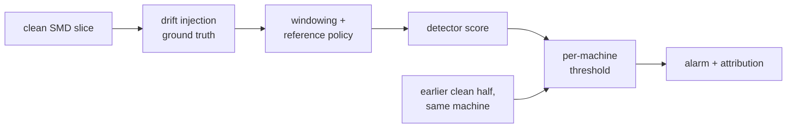

# SilentShift

Drift and behavioural change detection in multivariate server telemetry, with a controlled
injection framework that supplies ground truth.

The project answers two questions, and the answer to the second is the more useful one:

1. **Which statistics detect which kinds of change?** Some kinds are near-invisible to a whole
   family of detector, and the experiment measures how near.
2. **Does a threshold calibrated on clean history still hold later?** On this data, no — and
   that, not the choice of statistic, is what stops any of this from being deployable.

Every number below comes from an executed run. Where a pre-registered prediction turned out
wrong, it is reported as wrong.

---

## Why this problem matters

A monitor that alarms on point anomalies answers "is this minute strange". The question an
operator usually has is different: *has the thing I am watching changed, when did it start, and
which signals moved?* Those are not the same question, and a dataset labelled for anomalies is
not a drift benchmark. Conflating them is the common error here, and the negative control in
§ 7 exists to check we did not commit it.

## Problem

Given multivariate telemetry and no labels, decide whether the generating distribution has
changed, estimate when, and name the responsible features — evaluated against ground truth we
generate ourselves, which is only meaningful if the generator knows nothing about the detectors.

## Data

**Server Machine Dataset** (NetMan Lab, Tsinghua; MIT), 28 machines × 38 signals, 1-minute
cadence, ~5 weeks each. Provenance, licences, and the four datasets considered and rejected —
including why **ELEC2** and **NAB/SMAP/MSL** are unusable — are in [docs/DATA.md](docs/DATA.md).

SMD is used as a **substrate**, not a benchmark. We make no claim about anomaly-detection
performance on it, which is what sidesteps the criticism in Wu & Keogh (arXiv:2009.13807). What
we need from it is realistic noise: real marginals, real cross-feature correlation, real
autocorrelation, real machine-to-machine heterogeneity.

### The measurement that determined the design

Mean absolute autocorrelation across the 38 signals is still **0.29–0.57 at lag 100**, and does
not decay monotonically — it dips near lag 300 and rises again near 600, a daily cycle. Per
machine, the lag at which it first falls below 0.3 is **73–191 rows**; below 0.1 it is
**231–1124**.

A 500-row window therefore holds roughly **three effectively independent observations**. Every
two-sample test here assumes i.i.d. draws; at that effective sample size none can work. The
first pilot ran at exactly that geometry and produced KS statistics of 1.0 on drift-free data.

Windows are sized by the autocorrelation, not by convenience: 2500 rows (~15–35 effective
samples) against a 4000-row reference. **This is a latency floor, not a tuning choice: nothing
here can notice a change in under ~40 hours of telemetry.**

## Approach



### "You injected it yourself, of course you found it"

The objection is right as stated. Three answers.

**The injection module has no knowledge of any detector.** It describes what changed in the
generating process; the detectors decide how to notice.

**The catalogue includes a change designed to defeat a whole detector family.**
`correlation_break` block-permutes the post-onset values of the affected columns, so the
marginal distribution over the entire post-onset region is **bit-for-bit identical** before and
after — asserted by a test, not by a comment.

| Scenario | What is controlled |
|---|---|
| `sudden_shift` | onset, affected features, magnitude in pre-onset sigma |
| `gradual_shift` | mixture ramp — a growing *fraction* of rows switch regime |
| `incremental_shift` | every row moves a little; magnitude ramps to full |
| `variance_shift` | spread changes, mean held fixed |
| `correlation_break` | dependence destroyed, aggregate marginals preserved exactly |
| `none` | drift-free; the only source of false-alarm measurements |

**A data-independent control is scored alongside every detector**, and it found two real defects
in this project — § Error analysis.

## Validation

Design in [docs/VALIDATION_DESIGN.md](docs/VALIDATION_DESIGN.md); the ten standard sanity
questions in [docs/METHODOLOGY.md](docs/METHODOLOGY.md); the adversarial review, including the
bugs it found, in [docs/REVIEW.md](docs/REVIEW.md).

- **Unit of evaluation is a stream**, never a window. Windows overlap by 2000 of 2500 rows.
- **Two independent splits.** Machines split 11/11/6 for design decisions. *Within* each machine,
  the first 35% of clean history calibrates the threshold and the remaining 65% supplies
  evaluation streams — no row in both.
- **Thresholds are per machine**, forced by measurement: the calibrated threshold for
  `pca_recon` ranges from **1.04 to 26,171 across the 28 machines — a factor of 25,114**.
- **AUC is computed per machine, then averaged**, so a detector cannot score by telling machines
  apart.
- **False alarms are measured only on drift-free streams.**
- **No superiority claim across overlapping bootstrap intervals.**
- **5 of 16 windows per stream straddle the onset** and are excluded from both false alarms and
  detections. That is a third of the data, discarded deliberately and reported rather than
  buried.

Scale run: **392 calibrated thresholds** (28 machines × 14 detectors), **396 evaluation
streams**, **88,704 window scores**. Input digest in `artifacts/provenance.json`.

## Results

### 1. Dependence change is nearly invisible to marginal statistics

Per-machine window AUC separating post-onset windows from drift-free windows on
`correlation_break`. 0.5 is no information; the data-independent control measures 0.468.

| Detector | AUC | 95% CI | |
|---|---|---|---|
| `pca_recon` | **0.891** | [0.826, 0.946] | detects it |
| `iforest_mean` | **0.857** | [0.774, 0.924] | detects it |
| `wasserstein_max` | 0.620 | [0.536, 0.704] | weak but real |
| `ks_max_thinned` | 0.546 | [0.448, 0.645] | CI includes 0.5 |
| `c2st` | 0.543 | [0.435, 0.650] | CI includes 0.5 |
| `js_max` | 0.521 | [0.417, 0.629] | CI includes 0.5 |
| `psi_max` | 0.484 | [0.373, 0.592] | CI includes 0.5 |
| `ks_bonferroni` | 0.500 | [0.500, 0.500] | degenerate |
| `random` (control) | 0.468 | [0.425, 0.511] | — |

**A correction to the obvious claim.** "Marginal detectors are blind by construction" is too
strong, and `wasserstein_max` at 0.620 [0.536, 0.704], a CI excluding 0.5, is the evidence. The permutation
preserves the marginal exactly over the *whole* post-onset region, but a scored window is a
2500-row subsample of that region, and permutation moves values between windows. Measured
directly, the residual per-window deviation is a KS statistic of 0.010–0.022 — small, and enough
for a statistic sensitive to whole-distribution mass movement to extract a weak signal.

The precise claim: marginal statistics have **no access to the dependence change itself**, and
what little they detect is a finite-window artefact. The joint detectors are 0.86–0.89.

### 2. Overall discriminability at a 2-sigma shift

Mean per-machine AUC over the four shift scenarios:

| Detector | AUC | | Detector | AUC |
|---|---|---|---|---|
| `iforest_mean` | **0.977** | | `c2st_thinned` | 0.791 |
| `pca_recon` | 0.904 | | `psi_max` | 0.779 |
| `js_max_thinned` | 0.849 | | `js_max` | 0.772 |
| `c2st` | 0.846 | | `psi_max_thinned` | 0.770 |
| `ks_max` | 0.825 | | `wasserstein_max_thinned` | 0.760 |
| `wasserstein_max` | 0.819 | | `ks_bonferroni` | 0.500 |
| `ks_max_thinned` | 0.793 | | `random` (control) | 0.453 |

### 3. Two pre-registered predictions were wrong

Both recorded in [docs/METHODOLOGY.md](docs/METHODOLOGY.md) before the runs.

**`iforest_mean` was predicted to be mediocre.** It is the strongest detector in the study. The
reasoning was wrong in a specific way: a 2–4 sigma shift on six of 38 columns makes essentially
every point in the window individually unusual, so a point scorer has an easy job. The
prediction would have held only for a change that leaves points individually plausible — and on
the one scenario of that kind, `correlation_break`, it does fall behind `pca_recon`.

**A sliding reference was predicted to lose most of its power on `incremental_shift`.** It is the
one scenario where sliding *wins* (0.878 vs 0.849 fixed). With a sliding reference a linear ramp
produces a constant offset between window and reference from the very first window; with a fixed
reference the early post-onset windows have barely moved and only later ones separate. Sliding
sees it sooner but never more strongly — and it is clearly worse everywhere else (§ 5).

### 4. Thinning is not a general improvement

Subsampling by the estimated autocorrelation time, paired over 17 scenario × magnitude cells:

| Statistic | plain | thinned | delta | cells won |
|---|---|---|---|---|
| `js_max` | 0.771 | 0.824 | **+0.053** | 14/17 |
| `psi_max` | 0.705 | 0.732 | +0.027 | 12/17 |
| `ks_max` | 0.804 | 0.778 | −0.025 | 2/17 |
| `wasserstein_max` | 0.790 | 0.736 | −0.054 | 1/17 |
| `c2st` | 0.821 | 0.754 | **−0.067** | 1/17 |

Thinning trades independence for sample size, and which side wins depends on the statistic.
Binned divergences gain; the classifier and the distance-based statistics lose, because they
needed the rows. The pre-registered prediction that thinning "restores dynamic range" holds only
for the histogram family.

### 5. Reference-window policy

Mean AUC over the three study detectors:

| Policy | `sudden` | `gradual` | `incremental` | `variance` | `corr_break` |
|---|---|---|---|---|---|
| `fixed` | **0.910** | **0.854** | 0.849 | **0.822** | **0.654** |
| `sliding` | 0.718 | 0.697 | **0.878** | 0.676 | 0.531 |

A sliding reference absorbs the change: by the time the window has moved, the reference has moved
with it. It costs 0.15–0.19 AUC on every scenario except the one where a constant local slope
works in its favour.

`reset_on_alarm` produced numbers **identical** to `fixed` — because the policy was never
actually exercised. See § Error analysis.

### 6. The main negative result: thresholds do not transfer

A threshold fitted on the first 35% of a machine's clean history, applied to the same machine's
later clean history, overshoots its false-alarm budget:

| Detector | target | achieved | inflation |
|---|---|---|---|
| `random` (control) | 0.125 | 0.153 | **1.23×** ← estimator noise only |
| `pca_recon` | 0.125 | 0.219 | 1.75× |
| `iforest_mean` | 0.125 | 0.233 | 1.86× |
| `c2st` | 0.125 | 0.318 | 2.55× |
| `js_max` | 0.125 | 0.398 | 3.18× |
| `psi_max` | 0.125 | 0.492 | 3.93× |
| `ks_max` | 0.125 | 0.511 | **4.09×** |

The control makes this readable. A data-independent scorer has the same distribution everywhere,
so its 1.23× is pure threshold-estimation noise. Everything above that gap is real: **a single
machine's drift-free distribution is itself non-stationary across weeks**, and a statistic that
reacts strongly to distributional change also reacts strongly to the machine's own natural drift.

The consequence at a realistic operating point — per-stream false-positive budget of 0.10,
matched on the evaluation period so the chance floor equals the target:

| Detector | `sudden` | `gradual` | `incremental` | `variance` | `corr_break` |
|---|---|---|---|---|---|
| `iforest_mean` | **1.00** | **1.00** | **0.91** | **0.77** | **0.41** |
| `psi_max` | 0.64 | 0.23 | 0.36 | 0.23 | 0.23 |
| `js_max_thinned` | 0.55 | 0.41 | 0.41 | 0.41 | 0.18 |
| `pca_recon` | 0.18 | 0.14 | 0.27 | 0.27 | 0.18 |
| `random` (control) | 0.18 | 0.14 | 0.14 | 0.14 | 0.05 |

**Only `iforest_mean` is clearly above the chance floor across the board.** `pca_recon`, which
leads on threshold-free discriminability, is barely distinguishable from the control once a
threshold has to be chosen — its scores separate well *within* a machine-period but its scale
moves too much between periods to sit above a fixed cut. That gap between AUC and deployable
recall is the honest summary of this project.

`c2st`, `c2st_thinned`, `ks_max`, `ks_max_thinned` and `ks_bonferroni` have **no usable operating
point at all**: their scores pile up on the maximum even with no drift, so the only threshold
meeting the budget is one the score can never exceed. Reported as saturation, not as recall 0.

### 7. Negative control: is this just anomaly detection with extra steps?

Detectors run over SMD's *test* half — a later period containing real labelled point anomalies
and no injected drift, at each machine's calibrated threshold:

| Detector | corr(score, anomaly density) | alarm rate |
|---|---|---|
| `ks_max` | 0.154 | 0.739 |
| `c2st` | 0.125 | 0.534 |
| `pca_recon` | 0.084 | 0.631 |
| `iforest_mean` | 0.065 | 0.784 |

The correlations are weak: the detectors are not simply re-finding labelled anomalies, which is
what the control was for. The alarm rates are reported next to them because a weak correlation
alone is ambiguous — and they are high, 53–78%. The consistent reading is that the detectors are
firing on the genuine distribution difference between the train and test periods rather than on
the anomalies inside it. For a drift detector that is arguably correct behaviour, and it is also
§ 6 restated: the thresholds do not survive a change of period.

### 8. Attribution: "why did it fire?"

Precision of the top-*k* attributed features against ground truth, *k* = 6 of 38. Random guessing
scores 6/38 = 0.158. (With exactly *k* selected and *k* affected, precision and recall are the
same number, so only one is reported.)

| Detector | mean | on `correlation_break` |
|---|---|---|
| `ks_max` | **0.692** | 0.273 |
| `wasserstein_max` | 0.688 | 0.288 |
| `js_max` | 0.629 | 0.265 |
| `psi_max` | 0.620 | 0.303 |
| `pca_recon` | 0.589 | **0.598** |
| `c2st` | 0.449 | 0.242 |

The `correlation_break` column reproduces § 1 independently: the marginal detectors collapse
toward the random-guess baseline because they have nothing to rank on, while `pca_recon` holds
its accuracy. Two independent measurements agreeing is worth more than either alone.

## Error analysis

The control detector earned its place twice, and the adversarial review found a third defect.

**The control found a bug in this repository.** In the first full run, `random` — which ignores
the data entirely — scored recall 1.00 on every scenario. Cause: it was constructed with a fixed
seed per detector rather than per stream, so it emitted the same sequence on every stream and was
a constant, not a control.

**The review found that runs did not reproduce.** Stream seeds came from Python's `hash()`, which
is randomised per process for strings, so two runs of `make all` silently drew different slices
of clean history. Replaced with a stable digest; there is now a regression test that launches two
interpreters and compares. The entire pipeline was re-run from scratch afterwards, and every
number above comes from that run.

**`reset_on_alarm` was never exercised.** `ReferenceTracker.notify_alarm` is implemented and
tested, but `score_stream` never calls it, because scoring happens before thresholds are applied
in the staged design. The policy therefore behaved exactly like `fixed`, which is why § 5 shows
identical rows. Found by noticing that two supposedly different configurations produced
bit-identical output. Not fixed in this iteration; wiring it requires an online threshold, which
is a design change rather than a patch.

Two further measurement errors were caught and corrected while building § 6: the false-alarm
budget was expressed per stream while calibration streams had 4 windows and evaluation streams
16 (not comparable), and a per-window budget of 0.125 implies a per-*stream* chance floor of
`1 − 0.875⁵ ≈ 0.49`, because a detection counts if any of five windows alarms. Reporting recall
against "a 0.125 budget" would have compared detectors to an unstated floor four times higher.

**Where detection is hardest.** `variance_shift` and `correlation_break` for the marginal family;
`incremental_shift` for anything with a fixed reference, since early post-onset windows contain
only a fraction of the eventual change.

## Repository structure

```
src/silentshift/
  config.py            typed config; every experiment knob lives in YAML
  timeseries.py        autocorrelation estimation and thinning
  injection/           drift catalogue + ground-truth generator
  data/                SMD loader, checksums, disjoint calibration/evaluation halves
  windows/             windowing and the reference-window policies
  detectors/           marginal and joint statistics behind one protocol
  evaluation/          thresholds, alarm accounting, AUC, calibration transfer
  reporting/           the figures this README cites
scripts/               run_experiment.py (staged), analyse.py
tests/                 156 tests
docs/                  DATA, VALIDATION_DESIGN, METHODOLOGY, REVIEW
notebooks/             the autocorrelation diagnostic that resized the windows
```

No Docker, no MLflow, no Airflow, no Kafka. Nothing here needs them.

## Reproduce

```bash
make setup
make data     # SMD, 466 MB, MIT
make all      # provenance -> calibrate -> main -> policy -> attribution -> control -> analyse
make test lint typecheck
```

`make all` takes ~40 minutes single-threaded, almost all of it in `main` and `policy`;
`make analyse` alone runs in ~13 seconds with 2000 bootstrap draws. Seeds are fixed in
`configs/default.yaml` and a SHA-256 digest of the input data is written to
`artifacts/provenance.json`.

Checks actually executed on this codebase: `pytest` 156 passed / 1 skipped, `ruff check` clean,
`mypy` clean over 19 source files.

## Limitations

- **No deployable detector came out of this.** At a realistic operating point only
  `iforest_mean` clears the chance floor, and no threshold holds its false-alarm rate across
  periods. Fixing that needs adaptive or continuously-recalibrated thresholds — a different
  project, and the obvious next one.
- **`reset_on_alarm` is unexercised** (see § Error analysis).
- **One change per stream.** Real systems drift repeatedly and drift back.
- **Injected changes are cleanly parameterised.** A real regression is messier than *k* sigma on
  six columns. That is the price of having ground truth at all.
- **SMD's `train` half is assumed drift-free** on the dataset's convention, not verified. If it is
  not, the measured false-alarm rates are pessimistic rather than flattering.
- **Held-out machines are still untouched.** Every number above is from the development split;
  the held-out run is deferred until the pipeline stops changing.
- **No external validation yet.** The USP Insects streams (CC BY 4.0), where drift is induced
  physically by a temperature schedule rather than arithmetically, are the intended check that
  these rankings are not an artefact of our own injections.
- **Attribution is scored generously**: top-*k* with *k* equal to the true count, which an
  operator would not know.

## Future work

In the order that would change conclusions: external validation on Insects; adaptive thresholds
that track a machine's own slow non-stationarity; wiring the alarm feedback loop so
`reset_on_alarm` becomes measurable; sequential change-point detection on a low-dimensional
summary, the only route to reacting faster than the ~40-hour floor the autocorrelation imposes.

## Licence

MIT. SMD is MIT and must be cited as Su et al., KDD 2019 — see [docs/DATA.md](docs/DATA.md).
