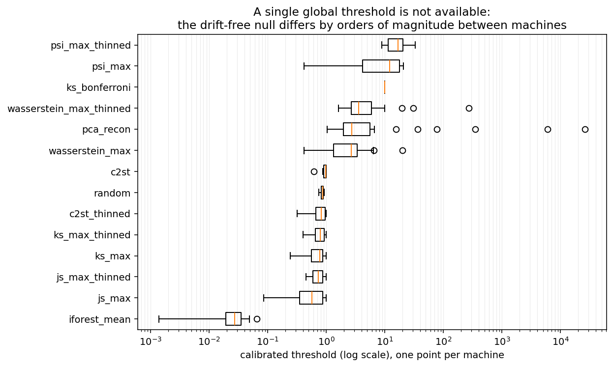
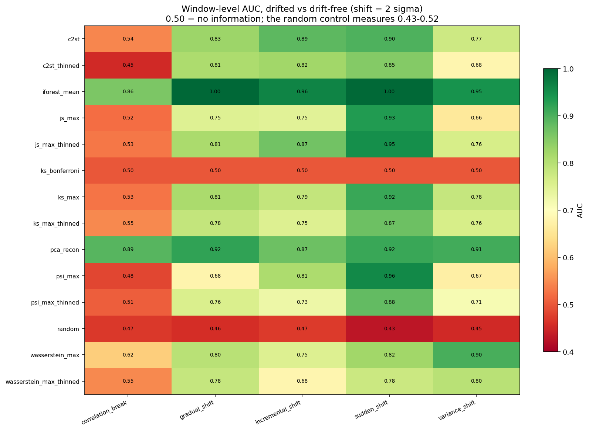
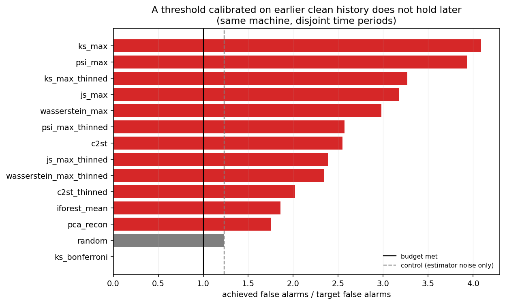
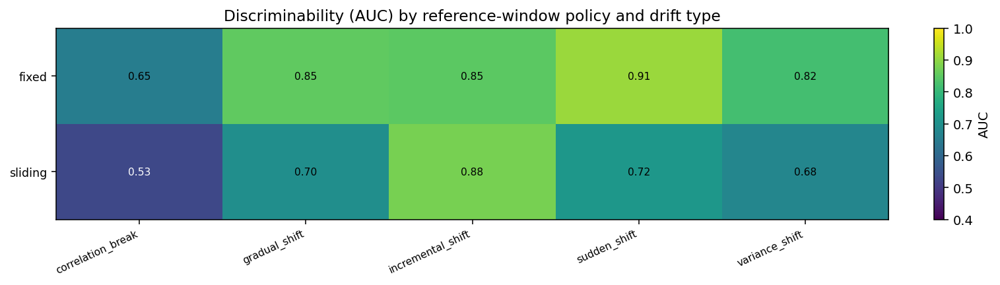

# SilentShift

[](https://github.com/forit-tech/SilentShift/actions/workflows/ci.yml)


**SilentShift** — обнаружение скрытых изменений поведения системы в многомерной телеметрии.

Вопрос не «странная ли эта минута», а **«изменился ли процесс, который порождает данные, когда это началось и какие сигналы за это отвечают»**. Это не то же самое, что поиск аномалий, и датасет с разметкой аномалий не является бенчмарком дрейфа.

Проект отвечает на два вопроса, и второй ответ полезнее первого:

1. **Какие статистики какой дрейф видят.** Некоторые изменения целая семья детекторов не замечает почти в принципе — здесь измерено, насколько «почти».
2. **Переносится ли порог, откалиброванный на чистой истории?** На этих данных — нет. И именно это, а не выбор статистики, не даёт довести систему до эксплуатации.

---

## Стек

| Слой | Технологии |
|------|-----------|
| Данные | Python 3.11+, pandas, Server Machine Dataset |
| Статистика | scipy, scikit-learn, numpy |
| Качество | pytest, ruff, mypy, GitHub Actions |

---

## 📸 Результаты в картинках

### Единый порог по флоту невозможен



*Рис.1 Откалиброванный порог, по одной точке на машину, шкала логарифмическая. У `pca_recon` он гуляет от 1.04 до 26 171 — в **25 114 раз**. Общий порог задавался бы самой шумной машиной и не говорил бы ни о какой.*

### Изменение зависимостей маргинальные статистики не видят



*Рис.2 Различимость без порога. 0.50 — отсутствие информации; контрольный детектор, игнорирующий данные, показывает 0.47. Столбец `correlation_break` — суть проекта: там, где перестановка сохраняет все одномерные распределения, работают только совместные статистики.*

### Главный результат — отрицательный



*Рис.3 Во сколько раз порог, настроенный на ранней чистой истории машины, промахивается мимо своего бюджета ложных тревог на её же более позднем периоде. Серая пунктирная линия — контроль: 1.23× это чистый шум оценки. Всё, что правее — реальная нестационарность.*

### Политика опорного окна против типа дрейфа



*Рис.4 Скользящее опорное окно поглощает изменение: пока окно доехало, опора уехала вместе с ним. Стоит это 0.15–0.19 AUC на всех сценариях, кроме одного.*

---

## ✨ Что здесь есть

- 🧪 Управляемая инжекция дрейфа с ground truth — шесть сценариев, включая тот, который целая семья детекторов не видит по построению
- 🔒 Пороги калибруются **на самой машине**, по временно непересекающемуся участку её же истории
- 📏 Оценка без порога отдельно от переносимости порога — два разных провала не смешиваются
- 🎯 Контрольный детектор, игнорирующий данные, считается наравне со всеми
- ⏱ Размер окна задан автокорреляцией данных, а не удобством
- 📊 Бутстрап по потокам и отказ от заявлений о превосходстве при пересекающихся интервалах

---

## Данные

**Server Machine Dataset** (NetMan Lab, Университет Цинхуа; MIT) — 28 машин × 38 сигналов, поминутно, около пяти недель.

SMD используется как **субстрат, а не как бенчмарк**. Никаких утверждений о качестве обнаружения аномалий на его метках не делается — именно это снимает критику Wu & Keogh (arXiv:2009.13807). От данных нужна реалистичность шума: настоящие маргиналы, настоящие корреляции между сигналами, настоящая автокорреляция, настоящая разнородность машин.

Отвергнуты: **ELEC2** (Жлёбайте, arXiv:1301.3524 — метки сильно зависимы во времени, наивный «повтори предыдущую метку» даёт ~85% там, где независимость дала бы ~51%), **NAB / SMAP / MSL** (та же критика, но жёстче, и это бенчмарки аномалий, а не дрейфа).

### Измерение, определившее весь дизайн

Средняя абсолютная автокорреляция по 38 сигналам держится на **0.29–0.57 на лаге 100** и падает немонотонно: проседает около лага 300 и снова растёт к 600 — это суточный цикл. По машинам лаг, на котором она впервые опускается ниже 0.3, составляет **73–191 строки**; ниже 0.1 — **231–1124**.

Значит, окно в 500 строк содержит примерно **три эффективно независимых наблюдения**. Все двухвыборочные тесты предполагают независимые выборки; при таком объёме ни один из них работать не может. Первый пилот шёл именно на такой геометрии и выдавал статистику Колмогорова–Смирнова 1.0 на данных **без** дрейфа.

Поэтому размер окна задан автокорреляцией: 2500 строк (~15–35 эффективных наблюдений) против опоры в 4000. **Это нижняя граница задержки, а не настройка: ничто здесь не заметит изменение быстрее чем за ~40 часов телеметрии.**

---

## «Ты сам инжектировал — сам и нашёл»

Возражение справедливо, и на него три ответа.

**Модуль инжекции ничего не знает о детекторах.** Он описывает, что изменилось в порождающем процессе; как это заметить — решают детекторы.

**В каталоге есть изменение, рассчитанное против целой семьи детекторов.** `correlation_break` переставляет пост-значения затронутых колонок блоками, поэтому маргинальное распределение по всей пост-области **побитово идентично** — это утверждает тест, а не комментарий.

**Рядом с каждым детектором считается контроль, не смотрящий на данные.** Он дважды нашёл настоящие дефекты в этом проекте.

| Сценарий | Что задано |
|---|---|
| `sudden_shift` | момент, затронутые признаки, величина в сигмах |
| `gradual_shift` | смесь: растущая **доля** строк переходит в новый режим |
| `incremental_shift` | каждая строка сдвигается понемногу, амплитуда нарастает |
| `variance_shift` | меняется разброс, среднее удерживается |
| `correlation_break` | связи разрушены, маргиналы сохранены точно |
| `none` | без дрейфа; единственный источник измерения ложных тревог |

Масштаб прогона: **392 откалиброванных порога** (28 машин × 14 детекторов), **396 оценочных потоков**, **88 704 оценённых окна**.

---

## Результаты

### 1. Зависимости почти невидимы для маргинальных статистик

AUC по машинам на `correlation_break`. Контроль показывает 0.468.

| Детектор | AUC | 95% ДИ | |
|---|---|---|---|
| `pca_recon` | **0.891** | [0.826, 0.946] | видит |
| `iforest_mean` | **0.857** | [0.774, 0.924] | видит |
| `wasserstein_max` | 0.620 | [0.536, 0.704] | слабо, но реально |
| `ks_max` | 0.528 | [0.429, 0.624] | ДИ накрывает 0.5 |
| `psi_max` | 0.484 | [0.373, 0.592] | ДИ накрывает 0.5 |
| `ks_bonferroni` | 0.500 | [0.500, 0.500] | вырожден |
| `random` (контроль) | 0.468 | [0.425, 0.511] | — |

**Уточнение к очевидной формулировке.** «Маргинальные детекторы слепы по построению» — слишком сильно, и `wasserstein_max` с интервалом, не накрывающим 0.5, это доказывает. Перестановка сохраняет маргинал точно по **всей** пост-области, но оцениваемое окно — подвыборка из неё, и перестановка перераспределяет значения между окнами. Измерено: остаточное отклонение KS внутри окна 0.010–0.022. Мало, но достаточно для статистики, чувствительной к переносу массы распределения.

Точная формулировка: у маргинальных статистик **нет доступа к самому изменению зависимостей**, а то немногое, что они ловят — артефакт конечного окна.

### 2. Различимость при сдвиге в 2 сигмы

| Детектор | AUC | | Детектор | AUC |
|---|---|---|---|---|
| `iforest_mean` | **0.977** | | `ks_max` | 0.825 |
| `pca_recon` | 0.904 | | `psi_max` | 0.779 |
| `js_max_thinned` | 0.849 | | `ks_bonferroni` | 0.500 |
| `c2st` | 0.846 | | `random` (контроль) | 0.453 |

### 3. Главный результат: порог не переносится

Порог, настроенный на первых 35% чистой истории машины, применённый к её же более позднему периоду:

| Детектор | цель | получилось | во сколько раз |
|---|---|---|---|
| `random` (контроль) | 0.125 | 0.153 | **1.23×** ← только шум оценки |
| `pca_recon` | 0.125 | 0.219 | 1.75× |
| `iforest_mean` | 0.125 | 0.233 | 1.86× |
| `psi_max` | 0.125 | 0.492 | 3.93× |
| `ks_max` | 0.125 | 0.511 | **4.09×** |

Контроль делает таблицу читаемой: у детектора, не смотрящего на данные, распределение везде одинаково, поэтому его 1.23× — чистая погрешность оценки порога. Всё, что выше этого зазора, реально: **распределение отдельной машины без всякого дрейфа само нестационарно на масштабе недель**, а статистика, чувствительная к изменению распределения, чувствительна и к естественному дрейфу этой машины.

На реалистичной рабочей точке (бюджет 0.10 ложных срабатываний на поток, пол случайности равен цели по построению) выше пола уверенно поднимается только `iforest_mean`. `pca_recon`, лидер по различимости без порога, от контроля почти неотличим, как только порог приходится выбирать. **Этот разрыв между «статистика различает» и «порог можно поставить» — честное резюме проекта.**

### 4. Два предсказания из шести не подтвердились

Записаны до запусков, оба разобраны, а не удалены.

**`iforest_mean` предсказывался посредственным** — он оказался сильнейшим. Рассуждение было неверным конкретно: сдвиг на 2–4 сигмы по шести колонкам из 38 делает подозрительной почти каждую точку окна, поэтому поточечному детектору задача даётся легко.

**Скользящее окно предсказывалось проигрышным на инкрементальном дрейфе** — это единственный сценарий, где оно выигрывает (0.878 против 0.849). При линейном нарастании скользящая опора даёт постоянное смещение с первого же окна, тогда как при фиксированной опоре ранние окна почти не отличаются.

---

## Дефекты, найденные в собственном коде

**Контроль нашёл баг.** В первом полном прогоне `random` — детектор, вообще не смотрящий на данные — показал recall 1.00 по всем сценариям. Причина: он создавался с фиксированным сидом на детектор, а не на поток, поэтому выдавал одну и ту же последовательность везде и был константой, а не контролем.

**Ревью нашло, что прогоны не воспроизводятся.** Сиды потоков брались из `hash()`, а Python рандомизирует хеширование строк на каждый процесс — два запуска `make all` молча брали разные срезы данных. Заменено на устойчивый дайджест; добавлен регрессионный тест, запускающий два интерпретатора и сверяющий сид. Весь конвейер после этого пересчитан с нуля.

**`reset_on_alarm` никогда не работала.** Политика реализована и покрыта юнит-тестами, но обратная связь по тревогам нигде не вызывается: скоринг идёт до применения порогов. Обнаружено по тому, что две якобы разные конфигурации совпали до последнего знака. Не починено — нужна онлайн-схема порогов, это изменение дизайна, а не заплатка.

Плюс две ошибки измерения, пойманные при построении раздела 3: бюджет ложных тревог был выражен на поток, тогда как калибровочные потоки имели 4 окна, а оценочные 16 — величины несопоставимы. И бюджет 0.125 на окно означает пол случайности **на поток** `1 − 0.875⁵ ≈ 0.49`, потому что попаданием считается тревога в любом из пяти окон. Отчёт «против бюджета 0.125» сравнивал бы детекторы с необъявленным полом вчетверо выше.

---

## Запуск

```bash
make setup
make data     # SMD, 466 МБ, MIT
make all      # provenance → calibrate → main → policy → attribution → control → analyse
make test lint typecheck
```

`make all` занимает ~40 минут в один поток, почти всё — этапы `main` и `policy`; `make analyse` отдельно отрабатывает за ~13 секунд при 2000 повторениях бутстрапа. Сиды зафиксированы в `configs/default.yaml`, дайджест SHA-256 входных данных пишется в `artifacts/provenance.json`.

Проверки, реально прогнанные на этом коде: `pytest` — **156 passed / 1 skipped**, `ruff check` — чисто, `mypy` — чисто, локально и в CI на Python 3.11 и 3.12.

---

## Структура

```
src/silentshift/
  config.py      типизированный конфиг; всё, что влияет на результат, живёт в YAML
  timeseries.py  оценка автокорреляции и прореживание
  injection/     каталог дрейфов и генератор ground truth
  data/          загрузка SMD, контрольные суммы, непересекающиеся половины истории
  windows/       нарезка окон и политики опорного окна
  detectors/     маргинальные и совместные статистики за одним протоколом
  evaluation/    пороги, учёт тревог, AUC, перенос калибровки
  reporting/     фигуры, которые цитирует этот README
scripts/         run_experiment.py (по стадиям), analyse.py
tests/           156 тестов
```

Осознанно отсутствуют Docker, MLflow, Airflow и Kafka — ни одна из них здесь ничего не решает.

---

## Ограничения

- **Пригодного к эксплуатации детектора не получилось.** На реалистичной рабочей точке пол случайности уверенно проходит только один детектор, и ни один порог не удерживает свой бюджет между периодами. Лечится адаптивной или регулярно пересчитываемой калибровкой — это другой проект и очевидный следующий.
- **`reset_on_alarm` не задействована** (см. выше).
- **Одно изменение на поток.** Реальные системы дрейфуют многократно и возвращаются обратно.
- **Инжектированные изменения аккуратно параметризованы.** Настоящая деградация грязнее, чем сдвиг на *k* сигм по шести колонкам. Это цена наличия ground truth вообще.
- **Чистая половина SMD считается бездрейфовой** по соглашению датасета, а не по проверке. Если это не так, измеренные ложные тревоги пессимистичны, а не льстивы.
- **Отложенные машины не тронуты.** Все числа получены на девелоперском сплите.
- **Внешней валидации ещё нет.** Потоки Insects из USP-репозитория (CC BY 4.0), где дрейф вызван физически расписанием температуры, а не арифметикой — намеченная проверка, что рейтинг детекторов не артефакт собственных инжекций.

---

## Лицензия

MIT. SMD распространяется под MIT и требует цитирования Su et al., KDD 2019.
